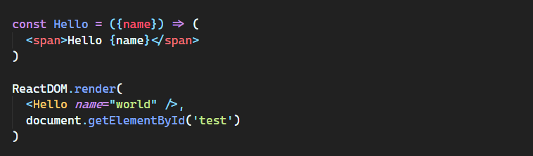
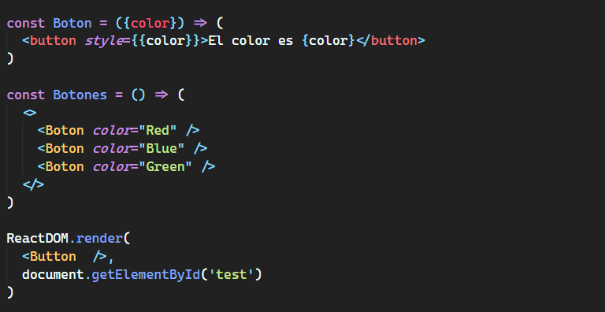
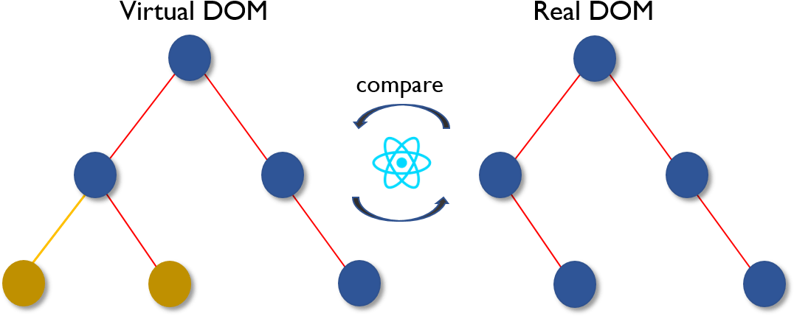
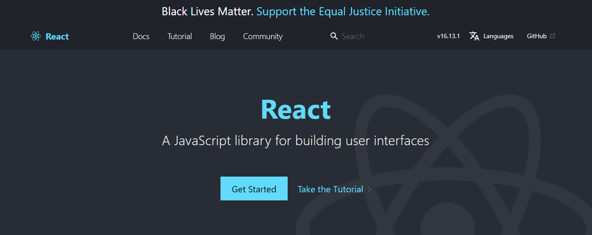

En algún momento de nuestra carrera de desarrollo habremos escuchado de ReactJS, siempre diciendo de que React es lo mejor, si quieres hacer una pagina web o app usa React, React esto y lo otro.

Sin embargo, ¿te has preguntado por qué dicen eso?, ¿qué tanto hay de verdad en esas palabras?

Yo también me he sentido conmovido por esas preguntas y quisiera ayudarte a comprender mejor esta herramienta.

## Es muy fácil de aprender

_Creando un componente_

React es una pequeña librería de vistas que te permite crear interfaces visuales de una forma muy fácil.

Al manejar una sintaxis muy sencilla cualquier desarrollador podría empezar a desarrollar aplicaciones web en muy poco tiempo.

## Componentes reutilizables

_Reutilizando un componente_

Puedes construir pequeños componentes como si fueran tus pequeñas piezas de lego y utilízalos las veces que quieras en tu proyecto tan solo creándolos una sola vez.

Tan fácil como crear un botón y utilizarlo en diferentes vistas incluso pudiéndolo hacer personalizable.

## Renderizados más rápidos con el VirtualDOM

_Virtual DOM_

Cuando estas creando aplicaciones que involucran mucha interacción del usuario y cambiando muchas vistas, es posible que puedas encontrarte con problemas de rendimiento.

Actualizar el <a target="_blank" href="https://developer.mozilla.org/es/docs/DOM">DOM</a> (que es básicamente la vista de la aplicación) puede ser algo complicado de manejar para el navegador, por lo cual React trata de solucionar este problema con una tecnología llamada VirtualDOM.

En esta <a target="_blank" href="https://developer.mozilla.org/es/docs/DOM">documentación</a> se explica con mas detalle la anterior explicación.

## Una comunidad muy fuerte

_ReactJS Web_

A los desarrolladores les encanta React, se ve en todos los <a target="_blank" href="https://stateofjs.com/">análisis</a>, hay una gran comunidad que soporta la herramienta, una gran <a target="_blank" href="https://reactjs.com/">documentación</a>, casi que a cada error le encontraras una solución, hasta cursos y tutoriales para crear todo tipo de proyectos.

## Herramientas de desarrollo

_React Developer Tools_

En forma de <a target="_blank" href="https://chrome.google.com/webstore/detail/react-developer-tools/fmkadmapgofadopljbjfkapdkoienihi?hl=es">plugin</a> React tiene unas herramientas de desarrollo que puedes utilizar mientras desarrollas tu proyecto.

De manera grafica puedes ver que componentes están renderizados, sus estados, el rendimiento, tiempos de respuestas y muchas cosas mas que facilitan el desarrollo.

Esta es apenas una pequeña vista de porque puede ser tan bueno React, me quedaron muchas cosas interesantes por contarte como puede ser <a target="_blank" href="https://facebook.github.io/flux/">Flux</a>, <a target="_blank" href="https://es.reactjs.org/docs/context.html">ContextAPI</a>, <a target="_blank" href="https://reactnative.dev/">ReactNative</a>, entre otras, así que te invito a investigar y a que uses React hoy.
