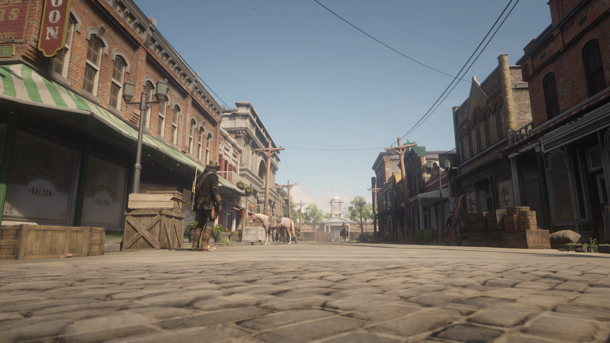
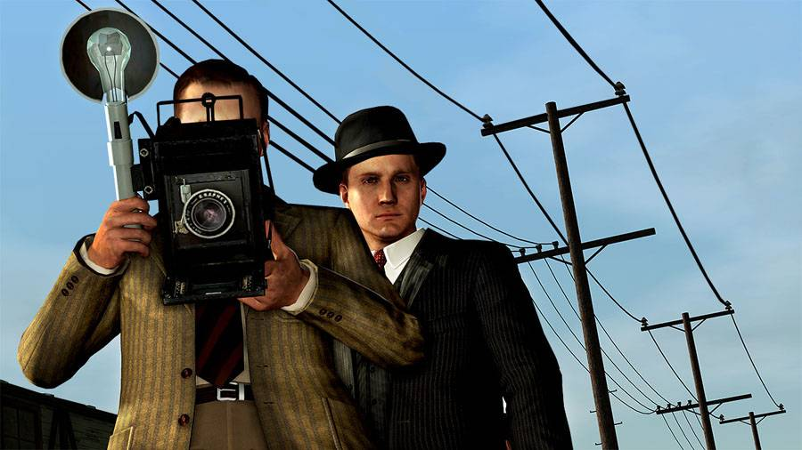
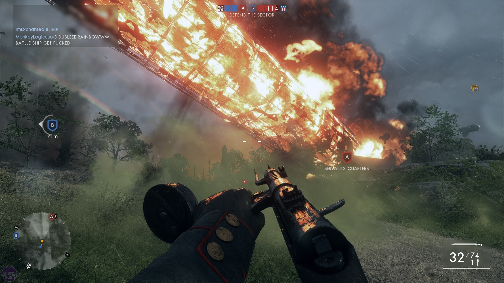
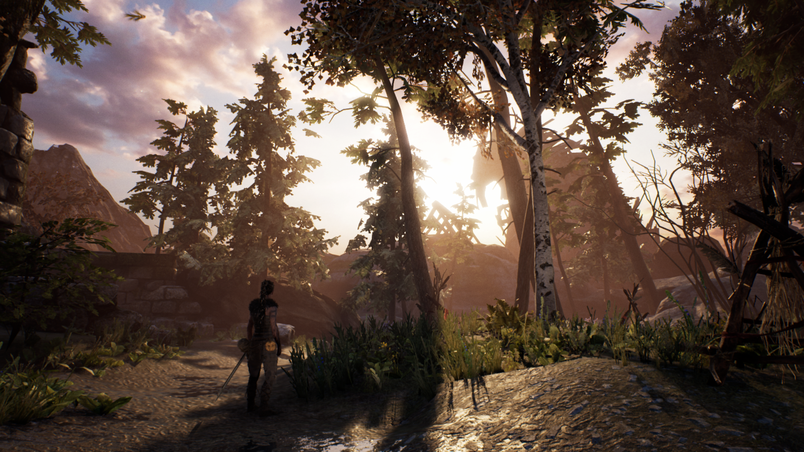

Podríamos tener en común que las clases de historia en nuestras escuelas no fueron de las más populares, sin embargo, en los videojuegos estas historias pueden llegar a ser de lo mas interesantes, llegando al punto de querer saber mucho más.

A mí en particular también me pasa, de alguna manera me envuelve la cultura y quiero investigar más al respecto, sobre todo saber si es verdad lo que me están contando.

Dependiendo de el videojuego se pueden encontrar muchas exactitudes y por supuesto también muchas diferencias, entonces ¿importan o no estas diferencias?

## Yo creo que si

_Red dead redemption 2_

Debería importar, al menos dependiendo de lo que quiera contar.

La idea de aprender historia mientras se juega puede desalentar a algunas personas, pero aun así hay juegos que te cuentan estas historias de una forma tan sutil que permaneces interesado en el videojuego.

A veces los que nos llama la atención de un juego no es la historia si no sus mecánicas, la manera de movernos en este mundo es lo que nos mantiene interesados.

Teniendo en cuenta lo anterior, la historia y las mecánicas son partes esenciales en un juego, dependiendo lo que te quiera decir el juego este mantendrá un equilibrio entre ambas o en algunos casos se le dará prioridad a las mecánicas y otros a la historia como tal.

Por lo tanto, podríamos organizar este tipo de videojuegos en los siguientes tipos.

## Equilibrio

_Assassins creed: syndicate_

En estos videojuegos te invitan a participar en su mundo de cualquiera de las dos formas, divirtiéndote, jugando o intrigado haciéndote cada vez mas interesado en su historia.

Claros ejemplos de esta modalidad, pueden ser los AC. La principal característica de estos juegos suele ser la mecánica de involucrarte en la piel de un asesino guiado por su brújula moral, contándote sus motivaciones, acciones y su razón de ser moviéndote por su mundo sutilmente.

La cantidad de detalle en los periodos temporales en que se desarrollan suelen rozar la perfección, desde fotografía, arquitectura y personajes famosos de la época, todo de manera opcional, dándote a ti la opción de irte por tu objetivo o por explorar todo lo que pasaba en ese periodo de tiempo.

## Prioridad: historia

_L.A. Noire_

En este tipo de juego se prioriza la historia como incentivo, garantizándote la veracidad de que los hechos ocurrieron en la vida real, sin descuidar la manera en como te mueves en su mundo.

Uno de los ejemplos mas destables de esta categoría de juegos puede ser L.A Noire. El juego relata eventos históricos ocurridos en los años 1950s, temas como corrupción, mafia, asesinatos famosos están entre sus principales historias.

Se hace evidente en este tipo de juegos que se hizo una gran cantidad de investigación alrededor de todos los temas que querían contarnos.

## Jugabilidad como arma

_Xbox one s: makinoxx_

Cuando es mas importante como un videojuego quiere que te muevas por su mundo, se tiende a dar menos importancia a la historia, eso si detallando los elementos para que no se pierda la referencia al periodo de tiempo en el que se desarrolla la experiencia.

Algunos juegos que toman esta iniciativa son los de disparos, por poner un ejemplo varios Battlefield toman guerras o eventos bélicos como objeto narrativo y usan las armas como hilo conductor.

Los modos de juego suelen ser lo mas destacable de estos títulos, muchas veces sin descuidar detalles en los personajes, armas, ambientes por poner ejemplos.

## Inspiración

_Xbox one s: makinoxx_

A veces es común ver videojuegos que se inspiran en eventos conocidos para tener una relación mas familiar o partir de un contexto ya establecido, cambiando así la historia, en ocasiones cambia tanto que se forma una nueva, dejando tan solo pequeñas relaciones por el camino.

Hay un caso particular que me llama la atención es Hellblade, sumergiéndote en un pasado nórdico lleno de simbolismo y cultura, en el cual te cuentan la historia de una chica con esquizofrenia, la cual nos guía en su búsqueda para salvar el alma de su amado.

Sin duda hay muchas formas de explorar eventos históricos en cuanto videojuegos se refiere, creo que lo mas importante debe ser equilibrio con la historia que se esta contando, ya que muchas veces no se tiene un entendimiento completo de la época en la cual están contando las cosas. Si te apasionan este tipo de historias no dudes en investigar para complementar mejor la historia.
